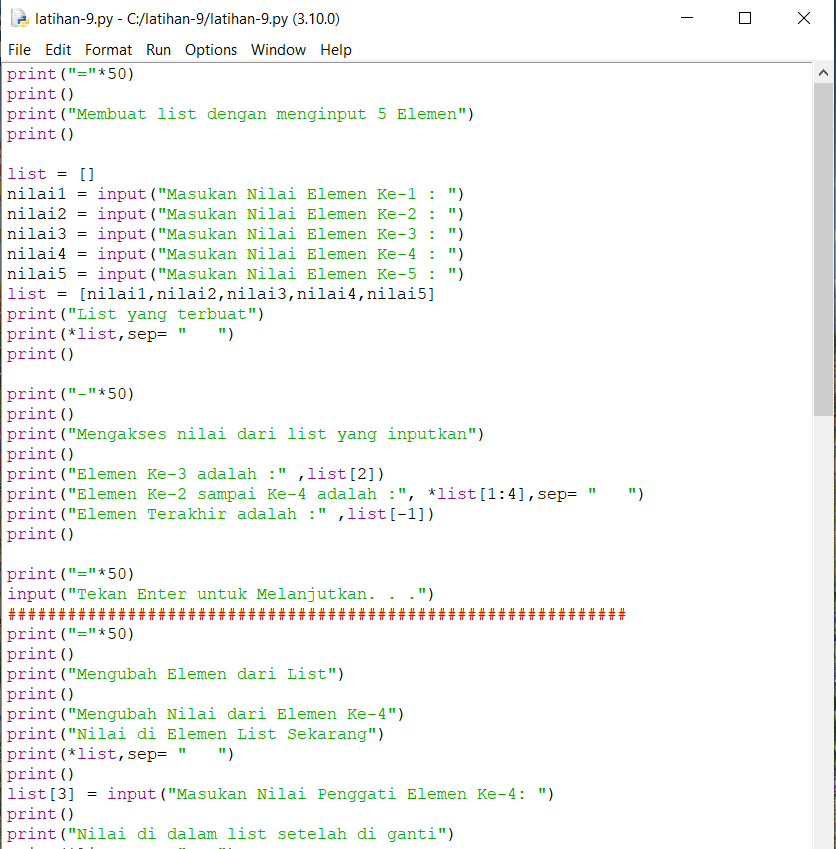
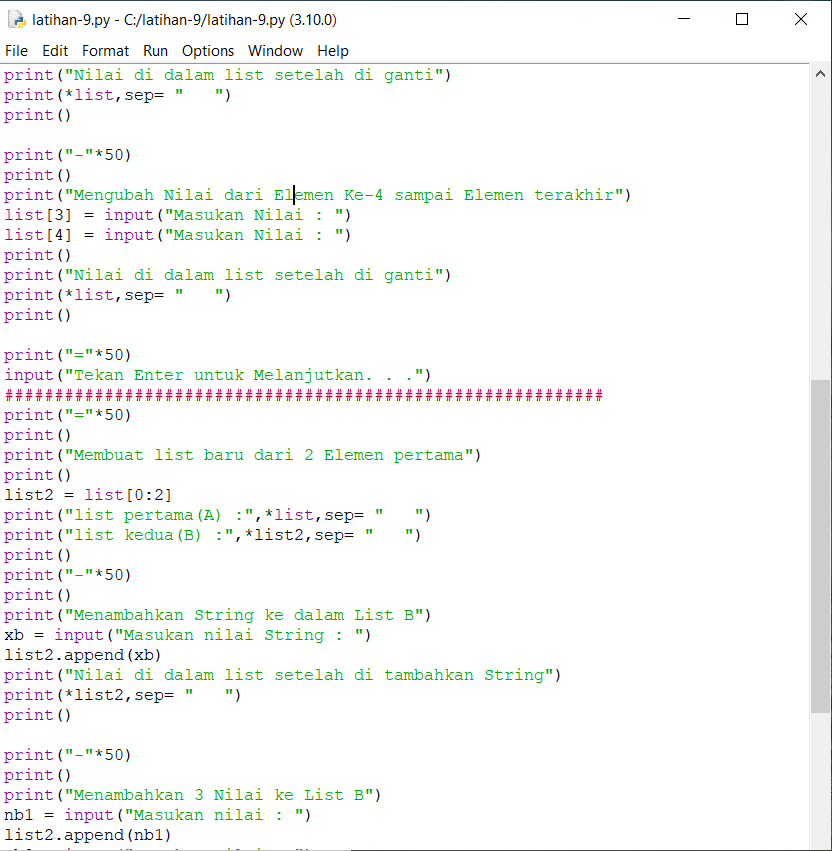
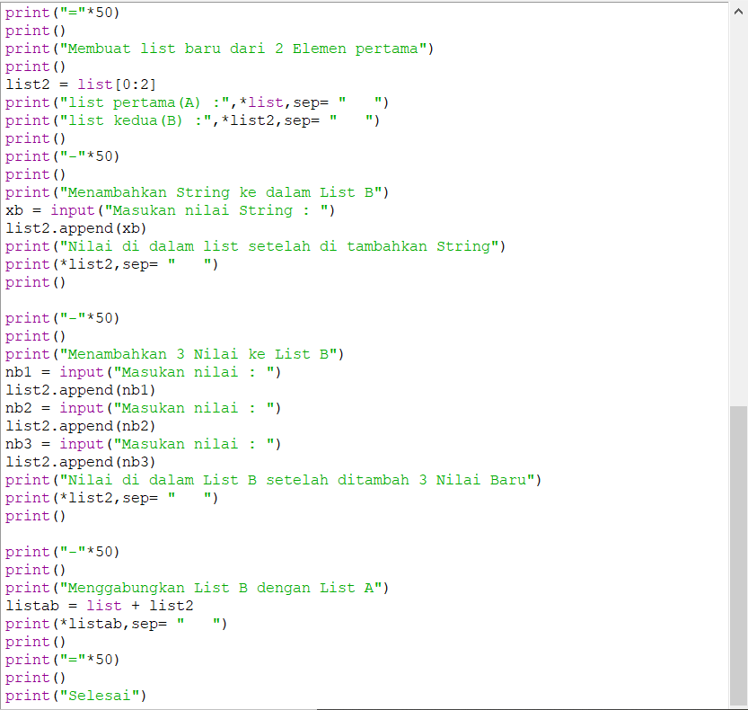
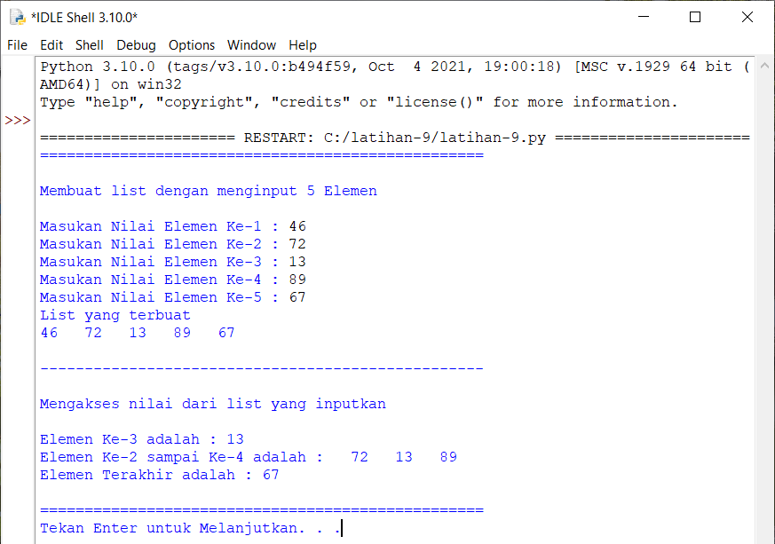
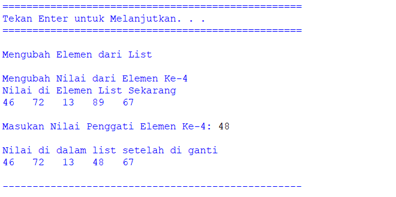
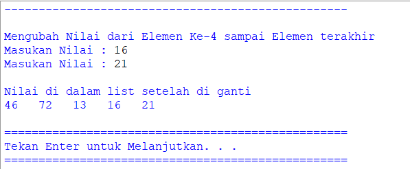
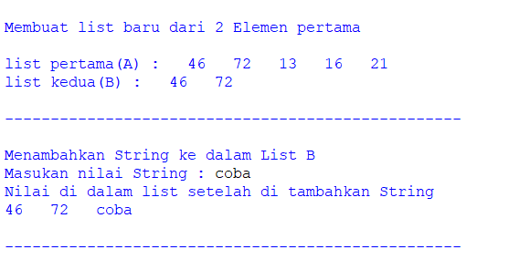
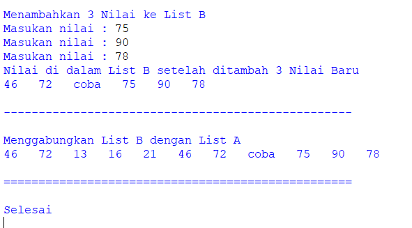

# latihan9
## Tugas Latihan - Pertemuan 9
## Materi List, Tuple, dan Dictionary

Ini adalah code pyhton saya

Membuat List dengan memasukan 5 Nilai
Nilai yang di input adalah 46, 72, 13, 89, dan 67
Menampilkan listnya
Mengakses nilai list.

Mengubah elemen ke-4 dari list dan menampilkannya
Dengan input 48.

Mengubah elemen ke-4 sampai elemen terakhir
Dengan input 16 dan 21.

Membuat list dengan 2 elemen dari list pertama
Dan menampilkannya
Menabahkan nilai baru kedalam List Kedua(B) dengan nilai String\
Dengan input "coba"

Menambakan 3 Nilai baru kedalam list kedua(B)
Dengan input 75, 90, dan 78.

